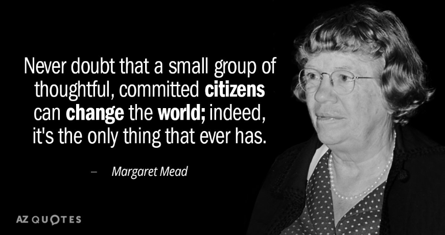
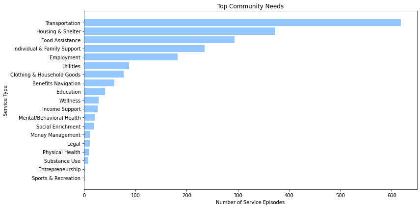
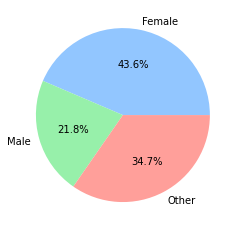

# **Community Needs**

### *Project by Gwen Duncan*
 

 

This project focuses on the needs of the Louisville, KY community for June 2022. I will be doing an assessment of what the most prominent needs are in the community based on the community's referrals for services. Using a deidentified dataset gathered from a technology platform called Unite US, I will assess what the most requested needs are, where are the most clients coming from in the community and other pieces of key information. I will use this baseline descriptive analysis to edge closer to forecasting, and predictive analysis and then on to prescriptive analysis. This project is the descriptive leg of the analysis, where we understand what needs are present in the community. The end goal for the remaining legs of the project are to predict the needs of the community at certain times of the year. This will allow us to better allocate, and time funding given to organizations that serve those needs within the community.  
 

## **Getting the Program to Run**
 

1. Make sure to have a version of Python3 installed on your computer, visit [Python.org](https://www.python.org/downloads/) and download Python for your machine.
2. After you have downloaded Python, clone the repository(repo) from github.
3. Within your cloned repository, it is best practice to setup a virtual environment(venv). This allows you to install any project requirements without interfering with what you currently have installed. To set up the venv, from within the cloned repo folder navigate to the file path line. Here you will type "cmd" into the file path to bring up the command terminal. From there run, "py -m venv env". This will create a folder named "env" within your repo folder. This will house the python venv. Once you have that created, you will need to activate it. Run 
".\env\Scripts\activate" from the command terminal. You will know your venv is active when you see (env) ahead of your directory path. Now your venv is ready to use.
4. From within that directory pip install the requirements.txt file by running "pip install -r requirements.txt". This will make sure you have the necessary packages to run the program. For this program, we will be using these libraries:
- Numpy
- Pandas
- Matplotlib Pyplot
5. Now that you have installed the packages and you are in the directory, you can run the program directly from the command terminal by running "needs_assessment.py" or you can open your favorite IDE (I use VSCode), open the repo folder and run the needs_assessment.py program.
6. Once you are done with the program, make sure you deactivate your venv. Run "deactivate" from the command terminal with the project directory.
 
 

### Alternatively, you can run the program using **jupyter notebooks**, follow the steps below:
 

1. Clone the repo from github.
2. Once you have cloned the repo, use File Explorer to navigate to the directory folder that contains the repo.
3. Once you have navigated to the folder, from the file path line type "cmd" to bring up the command prompt in that directory.
4. From the command line, run "jupyter notebook", this will open a browser window.
5. From the browser window open "needs_assessment.ipynb", run this to run the program.
 
 

## **Requirements Met**
 

This project incorporates the following Code Louisville requirements:
1. Read in data from a local csv, excel file, json, or any other file type.
2. Use built-in pandas or numpy functions to clean the data.
3. Use at least 5 different built-in Python functions to find out something about your data. I also created some calculations with Pandas.
4. Make 2 plots with matplotlib, seaborn, or any other kind of visualization library.
5. Write markdown cells in Jupyter explaining your thought process and code.

The final plots show what the top needs are in the community for June 2022 and what the gender breakdown is for the clients served. From these plots we see that Transportation and Housing were the top 2 needs of the clients and that the majority of those clients were female.
 
 
**Plot 1:**
 

 
**Plot 2:**
 

